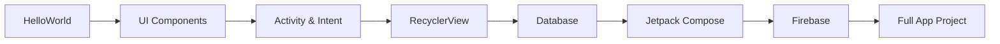

# 📱 Materi Pembelajaran Android Development - Kelas XI RPL

<div align="center">


**Repository Pembelajaran Android Development**  
**SMKN 2 Buduran - Jurusan Rekayasa Perangkat Lunak**

*"Dari Hello World hingga Full-Stack Android App"* 🚀

</div>

---

## 👨‍🎓 Tentang Repository

Repository ini berisi kumpulan materi, project, dan latihan Android Development yang saya pelajari selama di **Kelas XI Jurusan Rekayasa Perangkat Lunak (RPL) SMKN 2 Buduran**. Materi mencakup dari dasar-dasar Android hingga implementasi teknologi modern seperti **Jetpack Compose** dan **Firebase**.

---

## 📚 Struktur Pembelajaran

### 🤖 AndroidStudio (Basic to Advanced)

| No | Materi | Deskripsi |
|----|--------|-----------|
| 2-4 | **HelloWorld** | Pengenalan dasar Android Studio & struktur project |
| 5-6 | **Counter** | Implementasi counter sederhana dengan button |
| 7-8 | **Kalkulator** | Aplikasi kalkulator dengan operasi matematika dasar |
| 9-12 | **Konversi Suhu** | Aplikasi konversi suhu (Celsius, Fahrenheit, Kelvin) |
| 13-14 | **Message Dialog** | Implementasi AlertDialog & Toast |
| 15 | **Intent Activity** | Navigasi antar Activity menggunakan Intent |
| 16 | **Scroll View** | Implementasi ScrollView untuk konten panjang |
| 17 | **Date Picker** | Penggunaan DatePicker dialog |
| 18 | **Vector Asset** | Penggunaan Vector Drawable & Icon |
| 19 | **Card View** | Implementasi CardView untuk UI modern |
| 20-25 | **RecyclerViewCardView** | List dinamis dengan RecyclerView + CardView |
| 26-38 | **SQLiteDatabase** | CRUD operations dengan SQLite Database |
| 39-40 | **SharedPreferences** | Penyimpanan data sederhana dengan SharedPreferences |

---

### 🎨 JetPackCompose (Modern UI Toolkit)

| Project | Deskripsi |
|---------|-----------|
| **FirstComposeApp** | Pengenalan Jetpack Compose |
| **BasicCalculator** | Kalkulator dengan Compose UI |
| **Calculator** | Kalkulator dengan fitur lebih lengkap |
| **StateExample** | Pengelolaan State di Compose |
| **LazyColumn** | List efisien dengan LazyColumn |
| **LearnNavigation** | Navigasi dengan Navigation Compose |
| **TodoApp** | Aplikasi Todo List |
| **SimpleWeatherApp** | Aplikasi cuaca sederhana |
| **BukuRingkasApp** | Aplikasi ringkasan buku |

---

### 🔥 Firebase Integration

| Project | Deskripsi |
|---------|-----------|
| **FirebaseTutorial** | Integrasi Firebase (Auth, Firestore, Storage) |

---

### 📲 App Projects (Full Projects)

| Project | Deskripsi |
|---------|-----------|
| **AdminWafeOfFood** | Aplikasi admin untuk manajemen makanan |
| **EarningQuizApp** | Aplikasi quiz dengan sistem earning |
| **Food Ordering App** | Aplikasi pemesanan makanan |
| **SosialMediaApp** | Aplikasi sosial media |
| **WeatherApp** | Aplikasi cuaca dengan API |

---

### 🤖 LKS AI Project

| Project | Deskripsi |
|---------|-----------|
| **ChatBot** | Implementasi ChatBot dengan AI |

---

### 🏫 Pelatihan Android Studio

| Project | Deskripsi |
|---------|-----------|
| **BasicAndroid** | Dasar-dasar Android |
| **MultiActivity** | Multi Activity & Navigation |
| **AplikasiMonitoringKelas** | Aplikasi monitoring kelas |
| **sekolah-api** | Backend API untuk aplikasi sekolah |

---

## 🛠️ Tech Stack

<div align="center">

| Kategori | Teknologi |
|----------|-----------|
| **Language** | Kotlin, Java |
| **IDE** | Android Studio |
| **UI Framework** | XML Layout, Jetpack Compose |
| **Database** | SQLite, Firebase Firestore |
| **Authentication** | Firebase Auth |
| **Storage** | SharedPreferences, Firebase Storage |
| **Networking** | Retrofit, API Integration |
| **Architecture** | MVVM, Clean Architecture |

</div>

---

## 🚀 Getting Started

### Prerequisites
- Android Studio (Latest Version)
- JDK 17 or higher
- Android SDK
- Emulator atau Physical Device

### Clone Repository
```bash
git clone https://github.com/username/kelas-xi-rpl.git
```

### Membuka Project
1. Buka Android Studio
2. Pilih `File > Open`
3. Navigate ke folder project yang diinginkan
4. Tunggu Gradle sync selesai
5. Run project dengan `Shift + F10`

---

## 📸 Screenshots

> *Coming Soon* - Screenshot dari berbagai project akan ditambahkan

---

## 📖 Learning Path



**Rekomendasi urutan belajar:**

1. **Dasar Android** (HelloWorld → Counter → Kalkulator)
2. **UI Components** (ScrollView → CardView → RecyclerView)
3. **Data Persistence** (SharedPreferences → SQLite)
4. **Modern Android** (Jetpack Compose)
5. **Cloud Integration** (Firebase)
6. **Project Development** (App Projects)

---

## 🎯 Skills yang Dipelajari

- ✅ Android SDK & Android Studio
- ✅ Kotlin Programming Language
- ✅ XML Layout & UI Design
- ✅ Jetpack Compose
- ✅ Activity Lifecycle
- ✅ Intent & Navigation
- ✅ RecyclerView & Adapter Pattern
- ✅ SQLite Database Operations
- ✅ Firebase Integration
- ✅ REST API Consumption
- ✅ State Management
- ✅ Material Design Guidelines

---

## 🏆 Achievements

- 📱 Menyelesaikan 40+ tutorial Android
- 🎨 Implementasi Jetpack Compose modern
- 🔥 Integrasi Firebase services
- 📊 CRUD dengan SQLite Database
- 🤖 Membuat ChatBot dengan AI

---

## 📝 Notes

> Repository ini dibuat untuk keperluan pembelajaran dan dokumentasi progress belajar Android Development di SMKN 2 Buduran. Semua project bersifat educational dan open untuk dipelajari.

---

## 🤝 Contributing

Jika kamu menemukan bug atau ingin memberikan saran, silakan buat issue atau pull request!

---

## 📫 Contact

<div align="center">

**SMKN 2 Buduran**  
Jurusan Rekayasa Perangkat Lunak  
Kelas XI RPL

[](https://github.com/)
[](https://instagram.com/)

</div>

---

<div align="center">

**Made with ❤️ and ☕ by Siswa SMKN 2 Buduran**

*"Code, Learn, Repeat"*


</div>
