# 📱 Materi Pembelajaran Android Development - Kelas XI RPL

<div align="center">


<br/>


<br/>

**🎓 Repository Pembelajaran Android Development**  
**🏫 SMKN 2 Buduran - Jurusan Rekayasa Perangkat Lunak**

*"Dari Hello World hingga Full-Stack Android App"* 🚀

---

### 👨‍💻 Created by


[](https://github.com/ChristopherAldoNatanael)

</div>

---

## 👨‍🎓 Tentang Repository

> 🌟 **Halo! Saya Christopher Aldo Natanael**, siswa Kelas XI Jurusan **Rekayasa Perangkat Lunak (RPL)** di **SMKN 2 Buduran**.

Repository ini adalah dokumentasi perjalanan saya dalam mempelajari **Android Development**. Berisi kumpulan materi, project, dan latihan mulai dari dasar-dasar Android hingga implementasi teknologi modern seperti **Jetpack Compose**, **Firebase**, dan integrasi database **MySQL** & **SQLite**.

### 🎯 Tujuan Repository
- 📚 Dokumentasi pembelajaran Android Development
- 🔄 Tracking progress belajar dari basic hingga advanced
- 📖 Referensi untuk teman-teman yang ingin belajar
- 💼 Portfolio project untuk masa depan

---

## 📚 Struktur Pembelajaran

### 🤖 AndroidStudio (Basic to Advanced)

| No | Materi | Deskripsi |
|----|--------|-----------|
| 2-4 | **HelloWorld** | Pengenalan dasar Android Studio & struktur project |
| 5-6 | **Counter** | Implementasi counter sederhana dengan button |
| 7-8 | **Kalkulator** | Aplikasi kalkulator dengan operasi matematika dasar |
| 9-12 | **Konversi Suhu** | Aplikasi konversi suhu (Celsius, Fahrenheit, Kelvin) |
| 13-14 | **Message Dialog** | Implementasi AlertDialog & Toast |
| 15 | **Intent Activity** | Navigasi antar Activity menggunakan Intent |
| 16 | **Scroll View** | Implementasi ScrollView untuk konten panjang |
| 17 | **Date Picker** | Penggunaan DatePicker dialog |
| 18 | **Vector Asset** | Penggunaan Vector Drawable & Icon |
| 19 | **Card View** | Implementasi CardView untuk UI modern |
| 20-25 | **RecyclerViewCardView** | List dinamis dengan RecyclerView + CardView |
| 26-38 | **SQLiteDatabase** | CRUD operations dengan SQLite Database |
| 39-40 | **SharedPreferences** | Penyimpanan data sederhana dengan SharedPreferences |

---

### 🎨 JetPackCompose (Modern UI Toolkit)

| Project | Deskripsi |
|---------|-----------|
| **FirstComposeApp** | Pengenalan Jetpack Compose |
| **BasicCalculator** | Kalkulator dengan Compose UI |
| **Calculator** | Kalkulator dengan fitur lebih lengkap |
| **StateExample** | Pengelolaan State di Compose |
| **LazyColumn** | List efisien dengan LazyColumn |
| **LearnNavigation** | Navigasi dengan Navigation Compose |
| **TodoApp** | Aplikasi Todo List |
| **SimpleWeatherApp** | Aplikasi cuaca sederhana |
| **BukuRingkasApp** | Aplikasi ringkasan buku dengan AI |

---

### 🔥 Firebase Integration

| Project | Deskripsi |
|---------|-----------|
| **FirebaseTutorial** | Integrasi Firebase (Auth, Firestore, Storage) |

---

### 📲 App Projects (Full Projects)

| Project | Deskripsi | Tech Used |
|---------|-----------|-----------|
| **AdminWafeOfFood** | Aplikasi admin untuk manajemen makanan | Kotlin, Firebase |
| **EarningQuizApp** | Aplikasi quiz dengan sistem earning | Kotlin, SQLite |
| **Food Ordering App** | Aplikasi pemesanan makanan | Kotlin, MySQL, Retrofit |
| **SosialMediaApp** | Aplikasi sosial media | Kotlin, Firebase |
| **WeatherApp** | Aplikasi cuaca dengan API | Kotlin, REST API |

---

### 🤖 LKS AI Project

| Project | Deskripsi |
|---------|-----------|
| **ChatBot** | Implementasi ChatBot dengan AI (OpenAI Integration) |

---

### 🏫 Pelatihan Android Studio

| Project | Deskripsi |
|---------|-----------|
| **BasicAndroid** | Dasar-dasar Android |
| **MultiActivity** | Multi Activity & Navigation |
| **AplikasiMonitoringKelas** | Aplikasi monitoring kelas dengan MySQL Backend |
| **sekolah-api** | Backend REST API untuk aplikasi sekolah (Node.js + MySQL) |

---

## 🛠️ Tech Stack

<div align="center">

### 💻 Languages & Frameworks


### 🗄️ Database


### 🔧 Tools & Services


</div>

<br/>

| Kategori | Teknologi |
|----------|-----------|
| **Language** | Kotlin, Java, JavaScript |
| **IDE** | Android Studio, VS Code |
| **UI Framework** | XML Layout, Jetpack Compose, Material Design 3 |
| **Local Database** | SQLite, SharedPreferences, Room (ORM) |
| **Remote Database** | MySQL, Firebase Firestore |
| **Backend** | Node.js, Express.js |
| **Authentication** | Firebase Auth |
| **Cloud Storage** | Firebase Storage |
| **Networking** | Retrofit, OkHttp, Volley |
| **Architecture** | MVVM, Clean Architecture, Repository Pattern |
| **AI/ML** | OpenAI API Integration |

---

## 🚀 Getting Started

### Prerequisites
```
✅ Android Studio (Latest Version - Hedgehog or newer)
✅ JDK 17 or higher
✅ Android SDK (API Level 24+)
✅ Emulator atau Physical Device
✅ MySQL Server (untuk project backend)
✅ Node.js (untuk sekolah-api)
```

### Clone Repository
```bash
git clone https://github.com/ChristopherAldoNatanael/Kelas-XI.git
```

### Membuka Project
1. 🖥️ Buka **Android Studio**
2. 📂 Pilih `File > Open`
3. 📁 Navigate ke folder project yang diinginkan
4. ⏳ Tunggu **Gradle sync** selesai
5. ▶️ Run project dengan `Shift + F10`

### Setup Backend (sekolah-api)
```bash
cd "Pelatihan Android Studio/sekolah-api"
npm install
# Setup database MySQL
# Configure .env file
npm start
```

---

## 📸 Screenshots

<div align="center">

> 🖼️ *Screenshots dari berbagai project akan ditambahkan*

| Project | Preview |
|---------|---------|
| Calculator | 🔜 Coming Soon |
| Todo App | 🔜 Coming Soon |
| Weather App | 🔜 Coming Soon |
| Food Ordering | 🔜 Coming Soon |

</div>

---

## 📖 Learning Path

```mermaid
graph LR
    A[🟢 HelloWorld] --> B[🎨 UI Components]
    B --> C[🔄 Activity & Intent]
    C --> D[📋 RecyclerView]
    D --> E[💾 Database]
    E --> F[✨ Jetpack Compose]
    F --> G[🔥 Firebase]
    G --> H[🚀 Full App Project]
```



### 📚 Rekomendasi Urutan Belajar:

| Phase | Topics | Duration |
|-------|--------|----------|
| **1️⃣ Fundamentals** | HelloWorld → Counter → Kalkulator | 2 minggu |
| **2️⃣ UI Components** | ScrollView → CardView → RecyclerView | 3 minggu |
| **3️⃣ Data Persistence** | SharedPreferences → SQLite → MySQL | 4 minggu |
| **4️⃣ Modern Android** | Jetpack Compose → Navigation | 3 minggu |
| **5️⃣ Cloud Integration** | Firebase Auth → Firestore → Storage | 3 minggu |
| **6️⃣ Project Development** | Full App Projects | Ongoing |

---

## 🎯 Skills yang Dipelajari

<div align="center">

| Skill | Status | Level |
|-------|--------|-------|
| Android SDK & Android Studio | ✅ | ⭐⭐⭐⭐ |
| Kotlin Programming | ✅ | ⭐⭐⭐⭐ |
| XML Layout & UI Design | ✅ | ⭐⭐⭐⭐ |
| Jetpack Compose | ✅ | ⭐⭐⭐ |
| Activity Lifecycle | ✅ | ⭐⭐⭐⭐ |
| Intent & Navigation | ✅ | ⭐⭐⭐⭐ |
| RecyclerView & Adapter | ✅ | ⭐⭐⭐⭐ |
| SQLite Database | ✅ | ⭐⭐⭐⭐ |
| MySQL Database | ✅ | ⭐⭐⭐ |
| Firebase Integration | ✅ | ⭐⭐⭐ |
| REST API Consumption | ✅ | ⭐⭐⭐ |
| State Management | ✅ | ⭐⭐⭐ |
| Material Design | ✅ | ⭐⭐⭐⭐ |
| Git Version Control | ✅ | ⭐⭐⭐ |

</div>

---

## 🏆 Achievements

<div align="center">

🎯 **Progress Pembelajaran**


</div>

- 📱 Menyelesaikan **40+ tutorial** Android Development
- 🎨 Implementasi **Jetpack Compose** modern UI
- 🔥 Integrasi lengkap **Firebase services** (Auth, Firestore, Storage)
- 📊 **CRUD operations** dengan SQLite & MySQL Database
- 🤖 Membuat **ChatBot** dengan OpenAI API
- 🌐 Membangun **REST API** dengan Node.js + MySQL
- 📲 Develop **5+ full-stack Android applications**

---

## 📝 Notes

> 💡 Repository ini dibuat untuk keperluan pembelajaran dan dokumentasi progress belajar Android Development di **SMKN 2 Buduran**. Semua project bersifat **educational** dan open untuk dipelajari.

### ⚠️ Important
- Jangan lupa setup environment variables untuk API keys
- Pastikan MySQL server running untuk project yang membutuhkan backend
- Baca dokumentasi di masing-masing folder project

---

## 🤝 Contributing

Contributions are welcome! 🎉

1. Fork the repository
2. Create your feature branch (`git checkout -b feature/AmazingFeature`)
3. Commit your changes (`git commit -m 'Add some AmazingFeature'`)
4. Push to the branch (`git push origin feature/AmazingFeature`)
5. Open a Pull Request

---

## 📫 Contact

<div align="center">

### 👨‍💻 Christopher Aldo Natanael

**🏫 SMKN 2 Buduran**  
**📚 Jurusan Rekayasa Perangkat Lunak**  
**🎓 Kelas XI RPL**

<br/>

[](https://github.com/ChristopherAldoNatanael)
[](https://instagram.com/)
[](mailto:)

</div>

---

## 📄 License

<div align="center">

This project is licensed under the **MIT License** - see the [LICENSE](LICENSE) file for details.

</div>

---

<div align="center">

### ⭐ Star this repository if you find it helpful!

<br/>

**Made with ❤️ and ☕ by Christopher Aldo Natanael**

**SMKN 2 Buduran - Kelas XI RPL**

*"Dream Big, Code Hard, Never Give Up!"* 💪

<br/>


</div>
